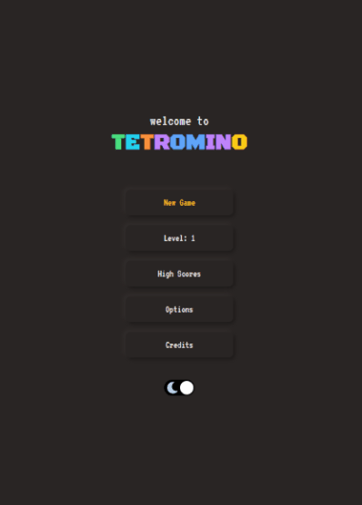

# Tetromino



A tetris-style game created with [React](https://reactjs.org/), [Redux](https://react-redux.js.org/) and [TailwindCSS](https://tailwindcss.com/).

## What is it?

For those of you not familiar with Tetris, it's a game where you drop tetromino shapes to create solid rows to score points. Blocks
fall faster as you increase the level. If there is no more room to drop blocks, then the game is over.

## Why build it?

Wanted to challenge myself to build a Tetris game using just DOM elements.
There are no SVGs or `<canvas>` graphics anywhere in the game.

All graphics are rendered as React functional components, and the game logic is handled by a Redux reducer.

## Where is it?

Online demo: [https://reactgular.github.io/tetromino/](https://reactgular.github.io/tetromino/)

## How to get it?

Clone and run it locally.

```bash
git clone https://github.com/reactgular/tetromino
cd tetromino
yarn install
yarn start
```
